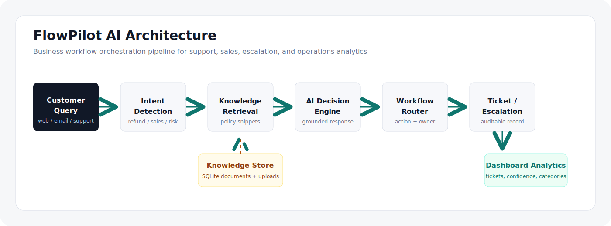
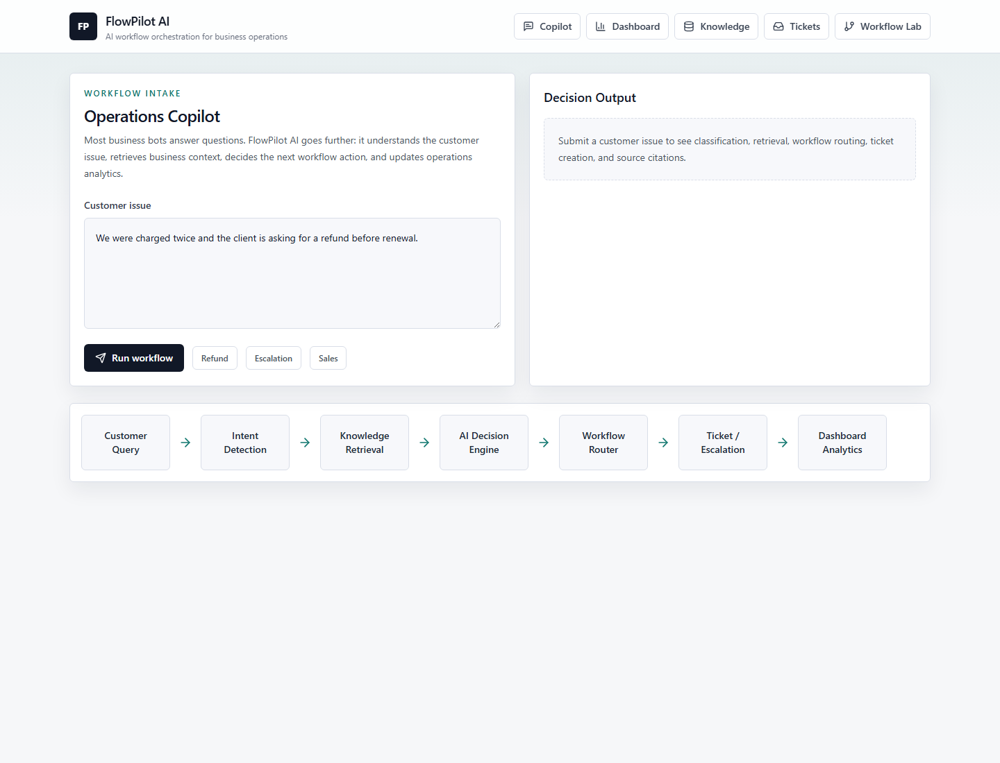

# FlowPilot AI

AI-powered business workflow orchestration platform with RAG-based support automation, intelligent ticket routing, multi-agent decision flows, and operational analytics.

[](https://nextjs.org/)
[](https://fastapi.tiangolo.com/)
[](https://ai.google.dev/)
[](https://tailwindcss.com/)
[](LICENSE)

Team: CodingGiants  
Track: Open Innovation  
Hackathon: FlowZint AI Hackathon 2026  
Repository: https://github.com/tauqxxr7/flowpilot-ai

FlowPilot AI is an AI-powered business workflow orchestration platform that combines retrieval-augmented intelligence, workflow routing, and operational analytics to help businesses automate support and decision workflows.


Most business bots answer questions. FlowPilot AI goes further: it understands the customer issue, retrieves the right business context, decides the next workflow action, and updates the operations dashboard. The product is intentionally not positioned as a chatbot; it is a workflow system for support, sales, onboarding, complaints, escalation handling, and operations teams.

## Problem Statement

Support and operations teams deal with repeated customer issues every day: refund requests, pricing questions, onboarding blockers, product failures, complaints, and escalation threats. A simple bot can draft a reply, but it usually does not know what should happen next.

That gap creates operational risk. A refund request needs billing review. A complaint with churn language needs ownership. A sales inquiry should move to the sales queue. A product issue needs enough context for support or engineering. FlowPilot AI is built around that next-action problem.

## Why FlowPilot AI Is Not Just A Chatbot

Most chatbot demos are built around one text box and one generated response. Real business workflows need more structure:

- verified company context instead of loose guesses
- source snippets that explain why a response was produced
- intent detection before response generation
- routing actions for teams and queues
- audit history for tickets and escalations
- dashboard visibility for operators

FlowPilot AI treats the customer message as the beginning of an operational workflow, not the end of a chat exchange.

The standout feature is Live Workflow Replay: every query produces a visible decision timeline from customer message to retrieved sources, confidence scoring, workflow route, ticket creation, and dashboard update.

## What FlowPilot AI Does

FlowPilot receives a customer issue, classifies the intent, retrieves relevant business knowledge, produces a grounded response, decides the next workflow action, stores the ticket, and updates operational analytics.

The MVP includes seeded FlowZint-style operating knowledge for pricing, refunds, onboarding, product support, complaints, and sales inquiries. Gemini can be used when `GEMINI_API_KEY` is configured, and the local fallback path keeps the demo stable when an API key is not available.

## Core Features

- Live Workflow Replay: a step-by-step decision timeline showing how a customer issue becomes a routed business workflow
- Knowledge base with seeded FlowZint-style policies and admin upload endpoint
- Customer query intake for support and sales issues
- Intent detection for refund, pricing, product support, onboarding, complaint, escalation, and sales inquiry patterns
- Retrieval-grounded response engine with cited snippets
- Workflow router with actions: auto-resolve, create ticket, escalate to human, send follow-up, mark high-risk customer
- Confidence score and owner assignment for each workflow decision
- SQLite ticket and workflow log persistence
- Operations dashboard with ticket volume, escalation count, response time, confidence distribution, category breakdown, and recent activity
- Admin-style pages for knowledge, tickets, and workflow testing
- Seeded demo tickets and workflow logs so judges can inspect an operational dashboard immediately

## Architecture Overview



The backend owns the workflow pipeline. The frontend is an operations console that shows the result of that pipeline in a way a support lead or hackathon judge can inspect quickly.

## AI Workflow Pipeline

1. Customer issue arrives through the Copilot console.
2. Backend detects intent from the message.
3. Retrieval searches indexed business knowledge.
4. AI decision engine prepares a grounded response using retrieved context.
5. Workflow router chooses the operational next step.
6. Ticket and workflow log are stored.
7. Dashboard analytics update from persisted records.

## Screenshots

### Landing / Copilot



### Dashboard


### Workflow Lab


### Ticket Routing


### Knowledge Base


## Tech Stack

Frontend:

- Next.js
- React
- Tailwind CSS
- lucide-react icons

Backend:

- FastAPI
- SQLite
- scikit-learn TF-IDF retrieval
- Gemini API integration hook

## API Endpoints

| Method | Endpoint | Purpose |
| --- | --- | --- |
| GET | `/health` | Service health check |
| POST | `/api/documents/upload` | Upload a text document into the knowledge base |
| GET | `/api/documents` | List indexed documents |
| POST | `/api/query` | Run the full customer issue workflow |
| GET | `/api/tickets` | List ticket history |
| GET | `/api/dashboard/stats` | Return dashboard metrics |
| POST | `/api/workflows/route` | Test workflow routing directly |
| GET | `/api/workflows/logs` | List workflow logs |

## Local Setup

Clone the repository:

```bash
git clone https://github.com/tauqxxr7/flowpilot-ai.git
cd flowpilot-ai
```

Backend:

```powershell
cd backend
python -m venv venv
venv\Scripts\activate
pip install -r requirements.txt
uvicorn main:app --reload --port 8000
```

The backend runs on `http://localhost:8000`.

Frontend:

```powershell
cd frontend
npm install
$env:NEXT_PUBLIC_API_URL='http://127.0.0.1:8000'
npm run dev
```

The frontend runs on `http://localhost:3000`.

Deployment notes are available in [docs/DEPLOYMENT.md](docs/DEPLOYMENT.md).

Optional Gemini setup:

```powershell
copy backend\.env.example backend\.env
```

Set `GEMINI_API_KEY` in `backend/.env`. The demo still works without it using the deterministic fallback response path.

## Demo Walkthrough

Target duration: 2 minutes.

1. Open `/dashboard` and frame the project: FlowPilot AI is an operations workflow platform, not a chatbot.
2. Open `/knowledge-base` and show seeded company context. Optionally upload a small `.txt` policy note.
3. Open `/workflow-lab` and run: `We were charged twice and need a refund before renewal.`
4. Zoom into the Live Workflow Replay: customer query received, intent detected, sources retrieved, AI decision generated, confidence scored, route selected, ticket created, dashboard updated.
5. Run the escalation prompt: `Our dashboard automation failed three times and the customer is threatening to escalate.`
6. Show that risk language routes the workflow to a human owner instead of auto-resolving.
7. Open `/tickets` to show persisted workflow history.
8. Return to `/dashboard` and show updated category, confidence, escalation, and recent activity metrics.

## Judging Criteria Alignment

- Innovation & Creativity: FlowPilot combines retrieval, intent detection, AI decision support, workflow routing, ticket creation, and analytics. The submission is an operations system rather than a chatbot wrapper.
- Real-World Problem Solving: The product reduces repetitive support triage while keeping risky cases visible for human teams.
- Technical Architecture: The MVP has a Next.js frontend, FastAPI backend, SQLite persistence, retrieval layer, optional Gemini integration, workflow rules, and dashboard APIs.
- Documentation & Presentation: The repository includes screenshots, setup steps, architecture notes, demo script, final checklist, and evaluation alignment.

## Known Limitations

- Uploaded files are treated as text in this MVP. PDF parsing can be added with `pypdf`.
- Retrieval uses TF-IDF for dependable local setup. FAISS or ChromaDB would be the next retrieval upgrade.
- Authentication and role-based access control are not included yet.
- Gemini is optional. Without `GEMINI_API_KEY`, the backend uses a deterministic grounded response so demos remain stable.
- Dashboard updates after API calls; WebSocket live updates are left for future scope.

## Future Scope

- FAISS or ChromaDB embedding retrieval
- PDF extraction and chunking pipeline
- User roles for support, sales, admin, and engineering
- WebSocket dashboard refresh
- PostgreSQL migration path
- Workflow queue abstraction for longer document ingestion jobs
- Evaluation tests for hallucination risk and routing quality

## Team

CodingGiants

Built as a serious student engineering MVP for the FlowZint AI Hackathon 2026.
