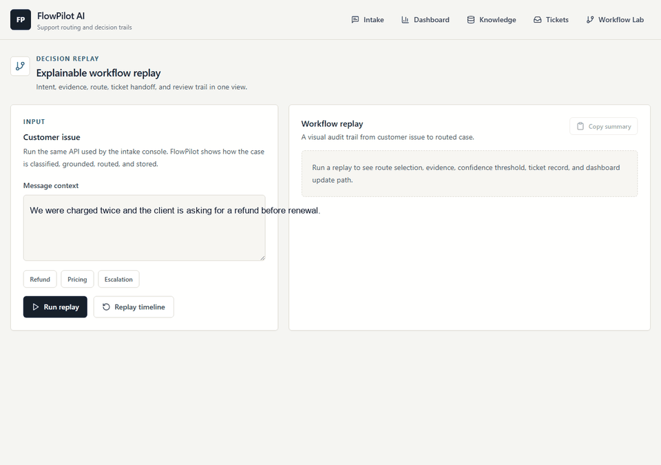
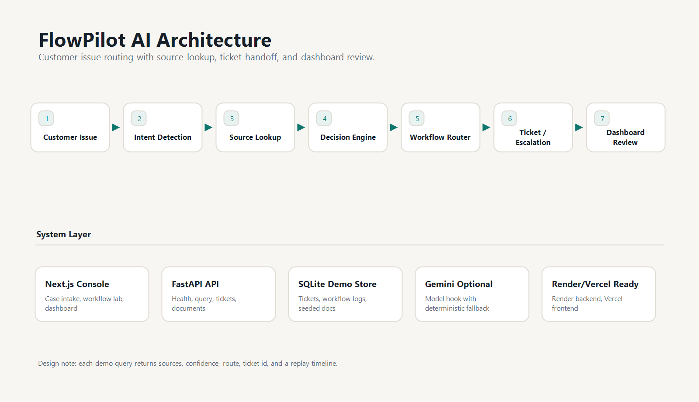
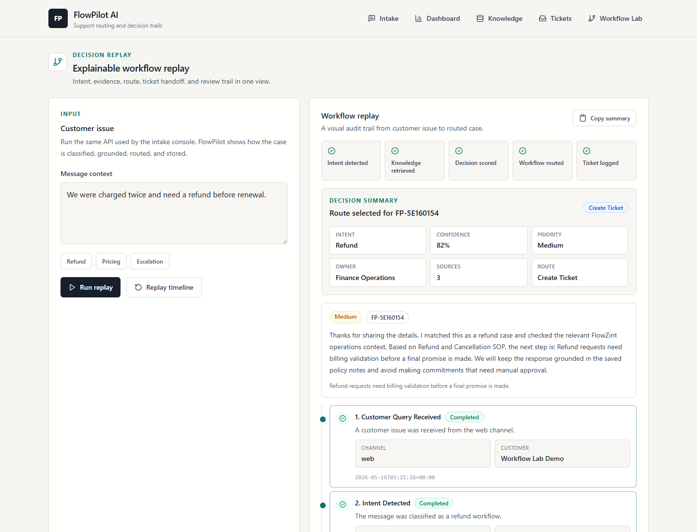
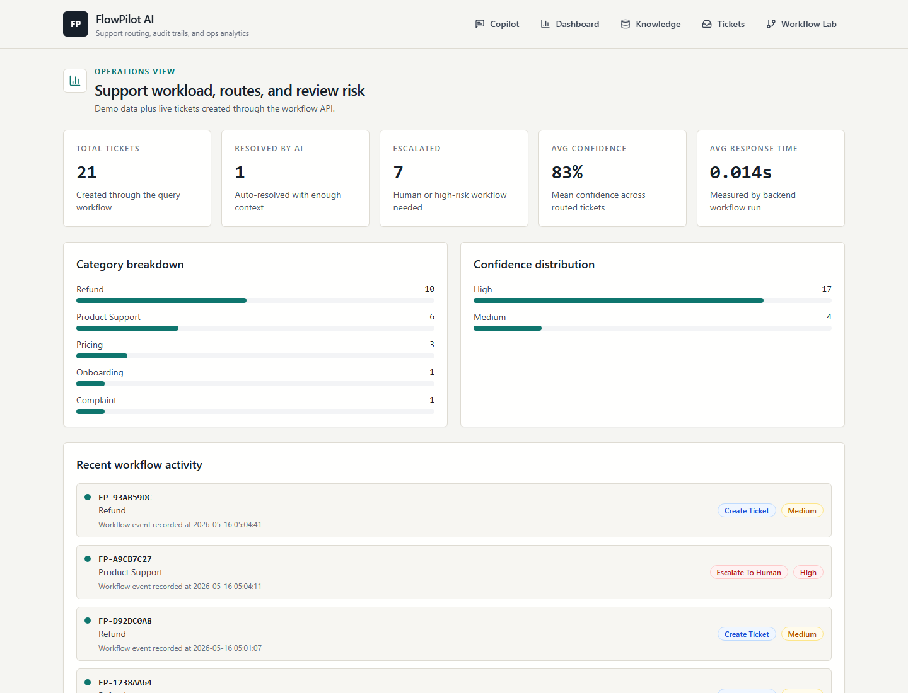
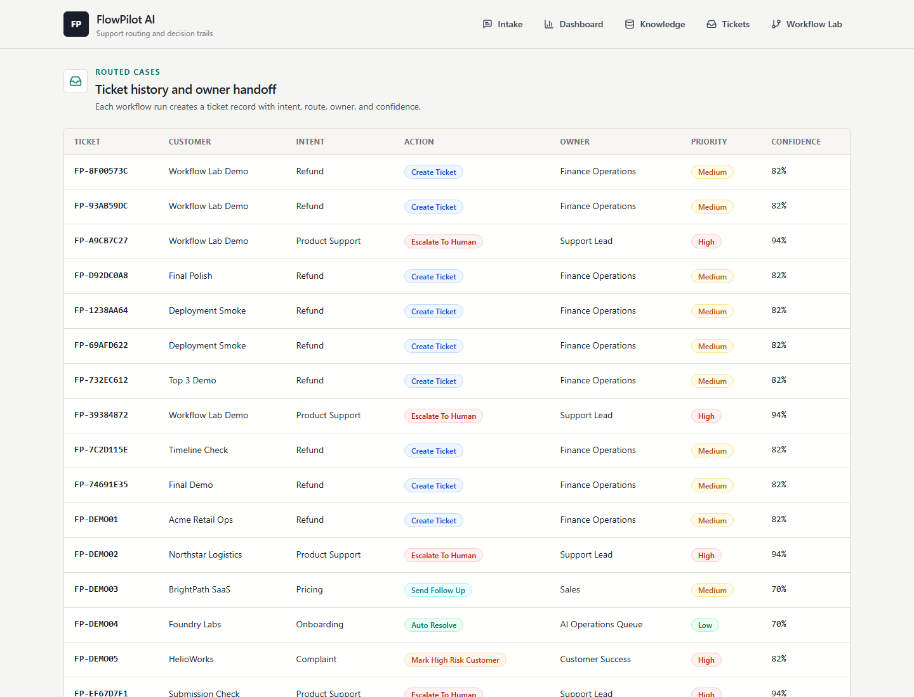
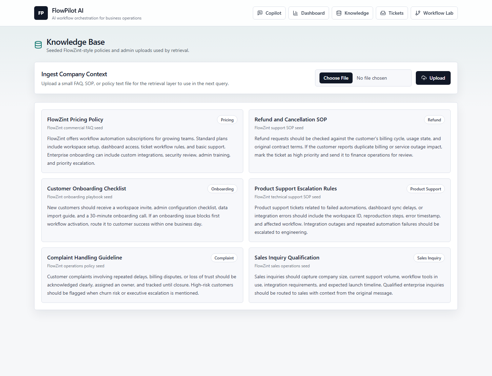

# FlowPilot AI

FlowPilot AI is a policy-grounded operational AI copilot for explainable support routing and workflow decision trails.

FlowPilot AI transforms enterprise support operations through policy-grounded AI routing, explainable workflow orchestration, and replayable decision intelligence.

Live Demo: https://flowpilot-ai-one.vercel.app  
Backend Health: https://flowpilot-ai-zndh.onrender.com/health  
GitHub: https://github.com/tauqxxr7/flowpilot-ai

Backend may take 30-60 seconds to wake up on Render free tier. If health shows 503, refresh once after wake-up.

## Demo Preview



[Watch full demo video](assets/demo/flowpilot-ai-demo.mp4)

This demo shows how FlowPilot AI transforms a customer issue into an explainable operational workflow with intent detection, policy grounding, routing confidence, ticket creation, cited policy snippets, and workflow replay.

[](https://nextjs.org/)
[](https://fastapi.tiangolo.com/)
[](https://ai.google.dev/)
[](https://tailwindcss.com/)
[](LICENSE)

Team: CodingGiants  
Track: Open Innovation  
Hackathon: FlowZint AI Hackathon 2026

FlowPilot AI routes customer issues through an explainable support workflow, from intent detection and source lookup to ticket creation, escalation, and dashboard review.

## Architecture Overview



## Why this is not just a chatbot

Most support bots stop after generating a reply. FlowPilot AI turns the customer issue into an explainable workflow record.

It:

- classifies the customer intent
- retrieves policy context from the knowledge base
- calculates routing confidence
- selects a workflow route
- creates or escalates a ticket
- shows a replayable decision trail for review

## Demo Metrics

The live demo surfaces three reviewable signals:

| Metric | What it shows |
| --- | --- |
| Confidence score | How strongly the system trusts the selected route |
| Escalation count | How many issues require human review |
| Ticket volume | How many customer issues have been converted into workflow records |

## Key Features

- Explainable operational audit trail for every submitted customer issue
- Policy-grounded source lookup with cited snippets
- Intent detection for refunds, pricing, onboarding, support, complaints, escalation, and sales inquiries
- Workflow routing for auto-resolve, ticket creation, escalation review, follow-up, and high-risk handoff
- Confidence scoring before the system recommends a route
- Ticket and workflow log persistence using SQLite for the demo MVP
- Operations dashboard for ticket volume, escalation count, confidence, category mix, and recent activity
- Seeded FlowZint-style business context so the demo opens with realistic support operations data

## Workflow Pipeline

1. Customer issue arrives through the intake console.
2. Intent detection classifies the operational category.
3. Source lookup retrieves relevant business policy context.
4. Decision engine prepares a source-backed support response.
5. Confidence scoring decides whether the case is safe to route or needs review.
6. Workflow router creates a ticket, escalates, or recommends the next action.
7. Dashboard analytics update from persisted workflow records.

## Why Workflow Replay Matters

Most support bots only return an answer. FlowPilot AI shows the operational decision trail behind that answer.

Workflow Replay acts as an explainable audit trail for support workflows. It shows what the system received, which intent it detected, which sources were used, how confidence was scored, why a route was selected, and whether a ticket or escalation was created. That makes the MVP easier to trust during a demo because the routing decision is visible instead of hidden behind a generated response.

## Tech Stack

Frontend:

- Next.js
- React
- Tailwind CSS
- lucide-react icons

Backend:

- FastAPI
- SQLite
- scikit-learn TF-IDF retrieval
- Optional Gemini API integration
- Deterministic fallback path for stable demos without an API key

## Local Setup

Clone the repository:

```bash
git clone https://github.com/tauqxxr7/flowpilot-ai.git
cd flowpilot-ai
```

Backend:

```powershell
cd backend
python -m venv venv
venv\Scripts\activate
pip install -r requirements.txt
uvicorn main:app --reload --port 8000
```

Frontend:

```powershell
cd frontend
npm install
$env:NEXT_PUBLIC_API_URL='http://127.0.0.1:8000'
npm run dev
```

Optional Gemini setup:

```powershell
copy backend\.env.example backend\.env
```

Set `GEMINI_API_KEY` in `backend/.env`. The demo still works without it using the deterministic grounded response path.

## Screenshots

### Workflow Lab



### Dashboard



### Ticket Routing



### Knowledge Base



## Deployment

Backend: Render  
Frontend: Vercel  
Production smoke test: [docs/PRODUCTION_SMOKE_TEST.md](docs/PRODUCTION_SMOKE_TEST.md)

Render backend setup:

```text
Root directory: backend
Build command: pip install -r requirements.txt
Start command: uvicorn main:app --host 0.0.0.0 --port $PORT
Environment: FLOWPILOT_ALLOWED_ORIGINS=https://flowpilot-ai-one.vercel.app
Environment: PYTHON_VERSION=3.11.9
```

Vercel frontend setup:

```text
Root directory: frontend
Build command: npm run build
Environment: NEXT_PUBLIC_API_URL=https://flowpilot-ai-zndh.onrender.com
```

Full deployment notes are available in [docs/DEPLOYMENT.md](docs/DEPLOYMENT.md).

## Docs

- [Architecture](docs/ARCHITECTURE.md)
- [Technical explanation](docs/TECHNICAL_EXPLANATION.md)
- [Presentation script](docs/PRESENTATION_SCRIPT.md)
- [Demo video guide](docs/DEMO_VIDEO_GUIDE.md)
- [Evaluation alignment](docs/EVALUATION_ALIGNMENT.md)
- [Final submission checklist](docs/FINAL_SUBMISSION_CHECKLIST.md)
- [Production smoke test](docs/PRODUCTION_SMOKE_TEST.md)
- [Known limitations](docs/KNOWN_LIMITATIONS.md)


## API Endpoints

| Method | Endpoint | Purpose |
| --- | --- | --- |
| GET | `/health` | Service health check |
| POST | `/api/documents/upload` | Upload a text document into the knowledge base |
| GET | `/api/documents` | List indexed documents |
| POST | `/api/query` | Run the full customer issue workflow |
| GET | `/api/tickets` | List ticket history |
| GET | `/api/dashboard/stats` | Return dashboard metrics |
| POST | `/api/workflows/route` | Test workflow routing directly |
| GET | `/api/workflows/logs` | List workflow logs |

## Demo Walkthrough

Target duration: 2 minutes.

1. Open the live dashboard and frame the project as a support workflow router, not a chatbot.
2. Open the knowledge base and show seeded company policy context.
3. Open [Workflow Lab](https://flowpilot-ai-one.vercel.app/workflow-lab).
4. Run: `We were charged twice and need a refund before renewal.`
5. Show the audit trail: intent, source lookup, confidence, route, ticket ID, cited snippets, and workflow replay.
6. Open tickets to show the persisted handoff.
7. Return to the dashboard and show updated operational metrics.

## Judging Criteria Alignment

- Model Innovation & Novelty: FlowPilot combines policy grounding, intent detection, decision support, routing, ticket creation, analytics, and an explainable operational audit trail.
- Real-World Applicability: The MVP targets repetitive support triage while keeping refund, risk, and escalation cases visible for human review.
- Technical Architecture: The project separates the Next.js operations console from the FastAPI workflow API, with persistence, retrieval, routing rules, and an optional Gemini hook.
- Documentation Clarity: The repository includes live links, screenshots, setup steps, deployment notes, architecture docs, demo scripts, and final submission checklists.

## Known Limitations

- Uploaded files are treated as text in this MVP. PDF parsing can be added with `pypdf`.
- Retrieval uses TF-IDF for dependable local setup. FAISS or ChromaDB would be the next retrieval upgrade.
- Authentication and role-based access control are not included yet.
- Gemini is optional. Without `GEMINI_API_KEY`, the backend uses a deterministic grounded response so demos remain stable.
- Dashboard data updates after API calls; WebSocket live updates are left for future scope.

## Future Scope

- FAISS or ChromaDB embedding retrieval
- PDF extraction and chunking pipeline
- User roles for support, sales, admin, and engineering
- WebSocket dashboard refresh
- PostgreSQL migration path
- Workflow queue abstraction for longer document ingestion jobs
- Evaluation tests for hallucination risk and routing quality

## Team

CodingGiants

Built as a serious student engineering MVP for the FlowZint AI Hackathon 2026.
